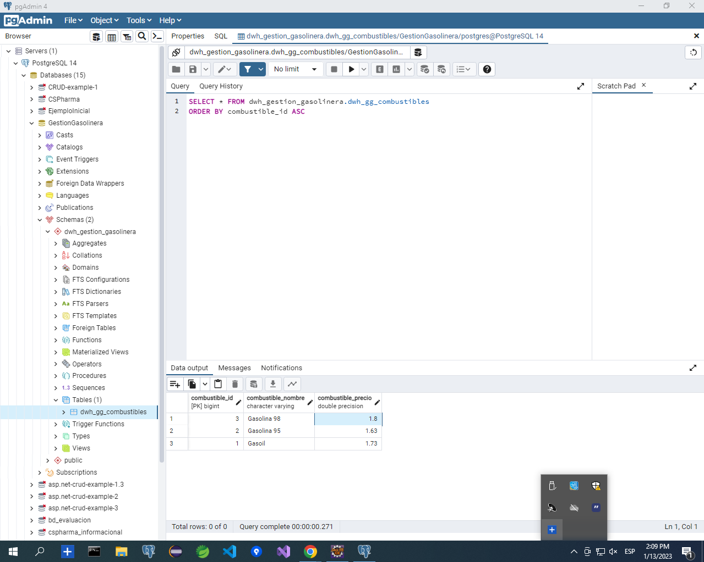

# Ejercicio Gestión Gasolinera

## Enunciado

Desarrollar una aplicación para la gestión de una gasolinera. 
Hay que registrar cada vez que un cliente realiza un repostaje. Existen dos tipos de repostajes:

- NORMAL: se guarda la fecha, la hora y el importe.
- FACTURA: se guarda la fecha, la hora, el importe del repostaje, el DNI del cliente y la matrícula del vehículo.

Además, es necesario llevar el control de cuándo los camiones cisterna rellenan los depósitos de la gasolinera. Cuando esto ocurre, hay que almacenar la cantidad de litros, el tipo de combustible (Gasoil, Gasolina 95 y Gasolina 98) y el importe total del combustible.

Al inicializar la aplicación, deberá aparecer un menú con las siguientes opciones:

1. Repostaje normal.
2. Repostaje factura.
3. Ver todos los repostajes.
4. Importe total combustible vendido.
5. Llenado de depósito.
6. Eliminar último llenado de depósito.
7. Ver todos los llenados de depósito.

- Las dos primeras opciones insertan en la BD.
- La tercera, muestra todos los repostajes que se han realizado.
- La cuarta, visualiza el importe total del combustible vendido hasta la fecha.
- La opción "Llenado de depósito", guarda en la base de datos la información de cuándo un camión cisterna surte de combustible a la gasolinera.
- En caso de que un operario se equivoque al introducir los datos del llenado de depósito, existe la posibilidad de eliminar el último que se ha realizado. 

- La interacción con la aplicación se hará por consola.
- Deberá seguir la arquitectura MVC.
- Los datos que se introduzcan o se muestren por consola vendrán de objetos de tipo DTO. La información que se transfiera a base de datos vendrá de objetos de tipo DAO.
- Los campos fechas se gestionarán con la anotación @Temporal.
- Los campos md_uuid y md_date no pueden ser nulos. 
- Ninguna tipología de campo podrá tomar el valor nulo en base de datos. Valores por defecto: numérico, 0; string, No informado; fecha, 31 de diciembre de 9999 a las 23:59:59.
- En base de datos, el prefijo del nombre de los esquemas hará referencia al nombre de la base de datos (ejemplo, bd_gestor_gasolinera).
- En base de datos, el prefijo del nombre de las tablas de base de datos hará referencia al esquema conceptual (dlk,dwh,dmt) y a la base de datos (ejemplo, dlk_gga_...).
- Toda clase y todo método estarán comentados. En el caso de lo métodos, si existe nivel de interfaz, se comentará a nivel de interfaz.
- Utilizar proyecto maven y JPA.

## Error al ejecutar

Cannot invoke "javax.persistence.EntityManager.getTransaction()" because "this.entityManager" is null

## Esquema Arquitectura

## Tabla de los combustibles

